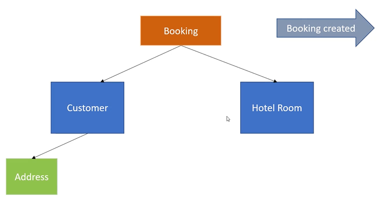
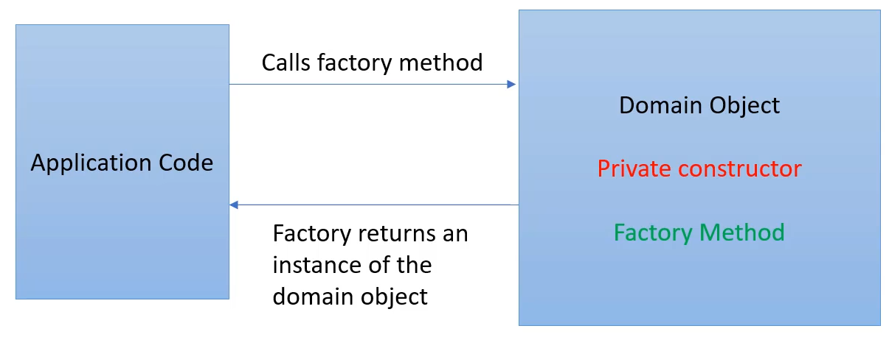
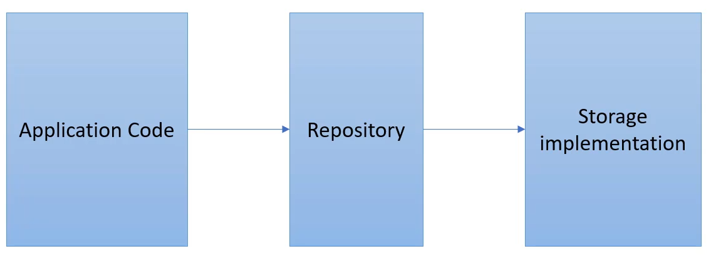
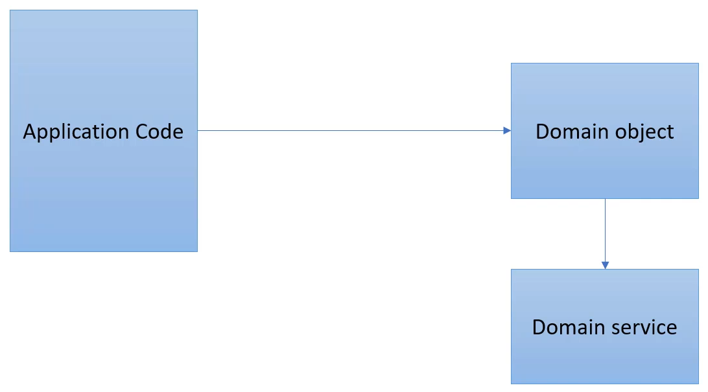
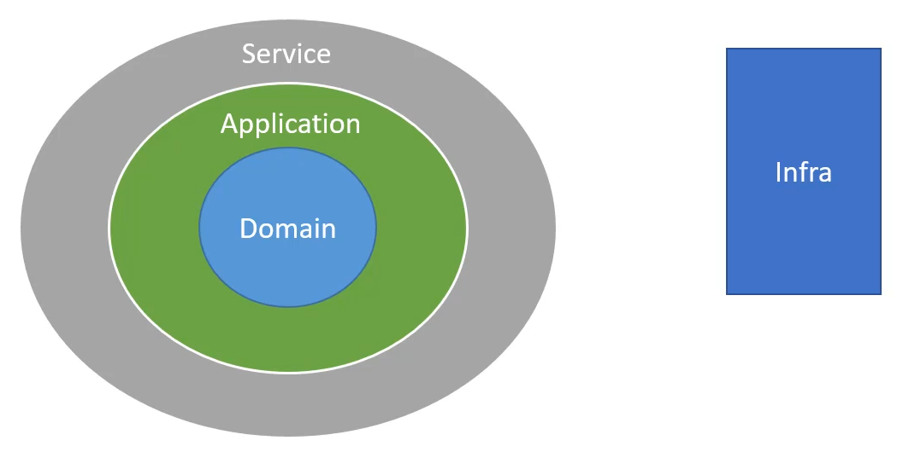
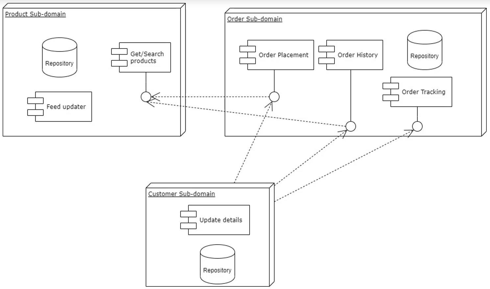

# Domain Driven Design Quickstart

## Building Blocks

- Domain - The subject area around which our program is going to be built
- Domain Model - A conceptual object model representing different parts of the domain, that will be used in our software. It includes both behavior and data.
- Bounded Context - The context to which a model can be applied. In a complex project, we often have multiple domains and each has their own bounded context.
- Ubiquitous language - the common domain language used within the team and in the code itself
- Entity: An object that is defined by a thread of continuity and its identity rather than by its attributes
- Value: An object that has attributes but no identity. It should be treated as immutable
- Aggregate: A collection of values and entities which are bound together by a root entity, known as an aggregate root. The aggregate root encapsulates these objects and external objects should not reference its members. This guarantees the consistency of changes being made within the aggregate.
- Domain Event: an event directly related to the domain.

### Hotel Booking Example

- _Customer_ is an entity
  - uniquely identifiable by customer ID
  - some attributes (eg address) change over time
- _Address_ is a value type
  - contains several other properties
  - country, postcode, street address ...
  - no need to be uniquely identifiable
- _Hotel Room_ is an entity if we want to identify each room uniquely
- _Booking_ is an aggregate object
  - contains both the customer and hotel room objects among others
- _Booking created_ is a domain event

## Design Patterns

### Factory Pattern

### Repository Pattern

### Service Pattern

## Component Architecture

Other architectures include 3-tire architecture, hexagonal architecture ...

## Assignment 1

### Scenario

An e-commerce clothing store is looking to re-design its monolithic system into a more modular system following domain driven design. Below are the main processes, flows, and functionalities in the system:

- Customers can view, filter and sort products on the site.
- Customers can order products, paying via card or through Paypal.
- Customers can redeem gift coupons and promotions to purchase products at a discounted price.
- Products should be updated via regular product feeds to update availability, sizes, and discontinuations.
- Customers can view their order history
- Customers can track unfulfilled orders.
- Customers can edit their personal information such as contact details and billing address.

### Solution

We can identify three main areas in our problem domain that can be viewed as subdomains. These are:

- The **customer** subdomain, responsible for handling customer-related information and performing functionality such as updating user details.
- The **order** subdomain, responsible for handling order-related functionality such as order histories, tracking, and fulfillment. Promotions and coupons could also be part of this subdomain and form part of the order domain entity. However, it's also possible to split these into their own subdomain. Similarly, with payments.
- The **product** subdomain, responsible for handling functionality such as search, product feed updates. The core domain entity here would, of course, be the product entity.

The following is a high-level component diagram:

Now, let's identify some **Domain-driven design** elements that will help us design our system, and code it out in later sections of the course. Let's discuss these within the bounded context of each subdomain:

**Product Subdomain**

- The product here is an entity that can be identified by its ID. A product can also act as the domain root of the components within the product module.
- The product can have properties that are entities such as the nearest available store, whilst other properties could be value objects such as the product color.
- Once the feed updater has triggered a product update, a domain event can be emitted that can be picked up by interested components - such as the customer subdomain to notify users that products they are interested in are available.

**Order Subdomain**

- The order is definitely an entity as it is uniquely identifiable by its ID.
- The subdomain's components could emit order created/updated/fulfilled domain events that would most likely interest the customer subdomain.
- The order placement component could make use of an Order Cost Calculation domain service, that order domain objects would call to obtain the order total values. Another possible domain service would be a shipping calculator service.

**Customer Subdomain**

- The customer object here will definitely be an entity, identified by ID.
- It could contain both value types such as the address together with sub-entities.
- Quite a straightforward subdomain so there seems to be no immediate need for domain services or events.

**Applicable to all subdomains**:

- Use of repository pattern to persist domain objects.
- Use of factory pattern to create domain objects.

## Assignment 2

### Scenario

An e-commerce clothing store is looking to re-design its monolithic system into a more modular system following domain driven design. Below are the main processes, flows, and functionalities in the system:

- Customers can view, filter and sort products on the site.
- Customers can order products, paying via card or through Paypal.
- Customers can redeem gift coupons and promotions to purchase products at a discounted price.
- Products should be updated via regular product feeds to update availability, sizes, and discontinuations.
- Customers can view their order history
- Customers can track unfulfilled orders.
- Customers can edit their personal information such as contact details and billing address.

**Design**

You are free to follow any suitable design to code out the solution. If you are unsure you can follow the model answer for the previous assignment as a basis to work on.

**Coding Guidelines**

Remember to make use of DDD building blocks and patterns including domain events, services, entities, value objects and patterns such as the repository and factory.

### Solution

## More Resources

- Design Patterns

  - _Level Up Coding_
    - [Singleton Pattern](https://levelup.gitconnected.com/design-patterns-in-python-singleton-pattern-f76dc26281f8)
    - [Factory & Abstract Factory Patterns](https://levelup.gitconnected.com/design-patterns-in-python-factory-pattern-beea1da31c17)
    - [Prototype Pattern](https://python.plainenglish.io/design-patterns-in-python-prototype-pattern-9e520d36565e)
    - [Builder Pattern](https://python.plainenglish.io/design-patterns-in-python-builder-pattern-d921fbac7fb3)
    - [Flyweight Pattern](https://towardsdev.com/design-patterns-in-python-flyweight-pattern-ec3d321a86af)
    - [Adapter Pattern](https://levelup.gitconnected.com/design-patterns-in-python-adapter-pattern-a5e53ed2c85d)
  - [Dive Into Design Patterns](https://refactoring.guru/design-patterns/python)
  - [Python Design Patterns](https://python-patterns.guide/) by Brandon Rhodes

- [Data Classes, Abstraction, and Interfaces in Python](https://python.plainenglish.io/data-classes-abstraction-interfaces-in-python-ea107d235d3e)
- [A Python Implementation of the Unit of Work and Repository Design Pattern using SQLModel](https://dev.to/manukanne/a-python-implementation-of-the-unit-of-work-and-repository-design-pattern-using-sqlmodel-3mb5)
